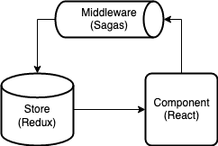

# Concepts: Overview of Redux & Sagas with React

## 10,000 Foot View

From way up high, we have React components that render data that has been fetched with Sagas and stored in a Redux store.
When data changes on the backend or when a user interacts with the UI, the data rendered with React must change. To keep data changes in-sync
across the application, we use a sigle source of truth, Redux. It acts as a data store, a snapshot, of the application state at a point in time.

Components subscribe to portions of the store, allowing them to listen in on changes to the data they care about. When a user changes data
(ex. updating an email address), the component will send a message to the store to inform it of the change. The message will then pass through the Saga
middleware. If it requires an asynchronous event (side-effect) like making an HTTP call, a Saga will run and when it resolves pass the another message along
to the store.

Based on the type of message being passed, the Redux store will accordingly update the application state. These data changes will then be pushed out to
all components interested in the updated portion of the store. React will render the new state and the cycle is complete.



## 1000 Foot View


### Folder Structure

I will preface this with a disclaimer: there is not a "correct" folder structure for a React/Redux project. It is highly dependant on the size and nature of your application.
What follows are recommendations, not gospel,to be used as guides.

**Small**

```
src
...index.js
...components
...redux
......rootReducer.js // actionTypes, action creators, and a reducer
......rootSaga.js // watcher function, sagas
......store.js // create store and middleware
```

**Medium**

```
src
...index.js
...components
...redux
......reducers
.........userReducer.js // reducer for user data
.........rootReducer.js // combine reducers
......sagas
.........userSaga.js // watcher function and sagas for user data
.........rootSaga.js // combine sagas
......actions.js // action creators
......actionTypes.js // action type constants
......store.js // create store and middleware
```

**Large**

```
src
...index.js
...components
...redux
......rootReducer.js // combine reducers
......rootSaga.js // combine sagas
......store.js // create store and middleware
......user // broken by domain
.........userReducer.js // reducer for user data
.........userSagas.js // watcher function and sagas for user data
.........userActions.js // user action creators
.........userActionTypes.js // user action type constants
```
